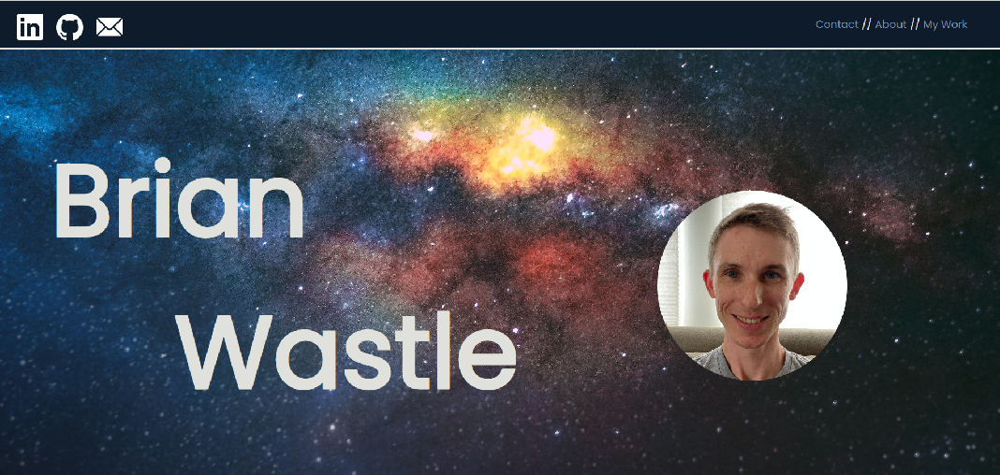

# Professional Portfolio Website

## Description

In order to provide a repository of previous coding work, I've complied this portfolio website with links to my emails and social media accounts. After looking at other portfolio websites I wanted something that would show some of my skills to make up for the lack of previous work. 

In the coding for this site I was able to utilize several display types and pseudoclasses. These show up in icon animations and a dropdown menu with CSS. The list of previous work uses a filter effect to show the links in black and white until the user hovers over them with the mouse. This is meant to demonstrate some utility with CSS and HTML despite not having a variety of projects to showcase.

I spent a lot of time exploring CSS documentation and experimenting with the language to emulate styles I had seen around the web previously. This project gave me a chance to test techniques I had learned previously in my coding Boot Camp as well as code functions I had learned on MDN Web Docs. 

## Installation

N/A

## Usage

Links to social media sites are in the header, along with a nagivation menu on the right. On small screens this will appear in a dropdown menu.

Additional social media links with lables are listed below the splash image. 

Under the My Work section, there are links to previous projects.

## Links
https://brian-wastle.github.io/Portfolio-Website/
